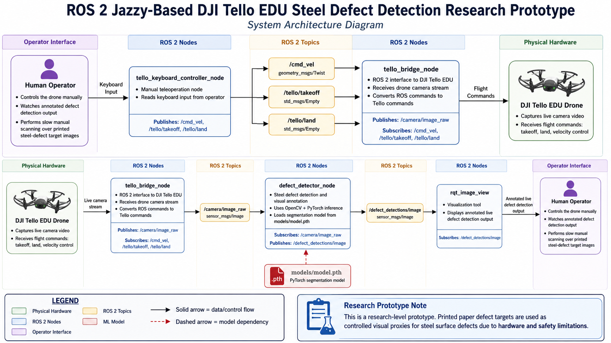

# tello_steel_defect_detection

https://github.com/user-attachments/assets/e4da3293-6f2a-4cca-bbc7-f2a56abfc376

ROS 2 Jazzy pipeline for flying a DJI Tello EDU manually while detecting and annotating steel surface defects from the live camera stream.

## Table of Contents
- [Project Scope](#project-scope)
- [Project Limitations](#project-limitations)
- [System Architecture](#system-architecture)
- [Reproducibility](#reproducibility)
  - [Tested Environment](#tested-environment)
  - [Clean Clone Setup](#clean-clone-setup)
  - [Model Checkpoint](#model-checkpoint)
- [Model Documentation](#model-documentation)
  - [Dataset and Task](#dataset-and-task)
  - [Runtime Model Configuration](#runtime-model-configuration)
  - [Training Source](#training-source)
  - [Expected Model Limitations](#expected-model-limitations)
- [Workspace Setup](#workspace-setup)
- [Primary Startup](#primary-startup)
- [Configuration](#configuration)
- [ROS 2 Launch Files](#ros-2-launch-files)
- [Runtime Benchmarking](#runtime-benchmarking)
- [Debugging Commands](#debugging-commands)
- [Custom Keyboard Teleoperation](#custom-keyboard-teleoperation)
- [Standard Keyboard Teleoperation](#standard-keyboard-teleoperation)
- [Optional Gamepad Teleoperation](#optional-gamepad-teleoperation)
- [Manual Scanning Workflow](#manual-scanning-workflow)
- [Safety Notes](#safety-notes)

## Project Scope
The goal of this project is to implement a real-time, aerial-to-desktop computer vision pipeline for automated steel surface inspection. The scope includes:

- Hardware Integration: Establishing a stable video telemetry link between a Tello EDU drone and a desktop host.

- Computer Vision Pipeline: Implementing a ROS 2-based system that captures, pre-filters, and crops drone imagery to isolate target defect regions on an inspection surface.

- Segmentation Inference: Executing a fine-tuned PyTorch model to perform semantic segmentation on captured defect regions, providing pixel-perfect localization of surface anomalies.

- Annotation/Visualization: Real-time generation of color-coded masks to visualize detected defects on a live video stream.

## Project Limitations
- Classification Accuracy: While the pipeline successfully achieves major defect localization and segmentation, it currently demonstrates insufficient performance in multi-class defect classification. The model struggles to reliably differentiate between specific defect sub-types of 4 classes.

- Domain Adaptation: The model was trained on high-resolution industrial sensor data; performance is degraded when inspecting printed test patterns on physical walls due to the inherent loss of contrast and the presence of paper texture, glare, and compression artifacts.

- Motion Blur and Drift: In-flight performance is constrained by the Tello EDU's optical flow stability. Featureless backgrounds or rapid drone movement may result in motion blur, limiting the resolution of captured defect imagery.

- Network Latency: The system relies on a 2.4GHz Wi-Fi link. Real-time inference performance is bound by network-induced packet loss and the inherent latency of the UDP-based H.264 video feed.

- Lighting Sensitivity: The segmentation pipeline relies on the contrast difference between the inspection target and the mounting wall. Variable ambient lighting significantly impacts detection stability.

## System Architecture


## Reproducibility

### Tested Environment

| Component | Version / Assumption |
| --- | --- |
| Operating system | Ubuntu 24.04 LTS |
| ROS 2 | Jazzy Jalisco |
| Python | 3.12 |
| ROS workspace | `tello_ws` |
| Main ROS package | `tello_defect_pipeline` |
| Drone | DJI Tello EDU |
| Tello connection | Host computer connected directly to the Tello Wi-Fi network |
| Tello app / firmware | Use the official Tello or Tello EDU app for initial pairing, battery checks, calibration, and firmware updates. The project does not currently pin a specific firmware version. |

### Clean Clone Setup

Install ROS 2 Jazzy and the ROS tooling first, then clone and build the workspace:

```bash
git clone <repo-url> ~/tello_steel_defect_detection
cd ~/tello_steel_defect_detection/tello_ws

source /opt/ros/jazzy/setup.bash

python3 -m venv --system-site-packages venv
source venv/bin/activate
python -m pip install --upgrade pip
python -m pip install -r requirements.txt

colcon build --symlink-install
source install/setup.bash
export PYTHONPATH="$PWD/venv/lib/python3.12/site-packages:$PYTHONPATH"
```

Install any missing ROS system dependencies with `apt` as needed for your machine, for example:

```bash
sudo apt install ros-jazzy-rqt-image-view ros-jazzy-cv-bridge
```

### Model Checkpoint

Place the trained PyTorch checkpoint at the default path:

```text
tello_ws/src/tello_defect_pipeline/models/model.pth
```

The model file is not generated by the ROS pipeline. It must be copied into the repository from the training workflow or another trusted source before running live inference.

The checkpoint path is configured in `tello_ws/src/tello_defect_pipeline/config/pipeline.yaml` through the `defect_detector_node.model_path` parameter.

## Model Documentation

The live ROS detector uses a fine-tuned steel defect segmentation model trained separately from this drone pipeline. The training work is maintained in [BlancJH/steel-defect-classification](https://github.com/BlancJH/steel-defect-classification), using the [Severstal Steel Defect Detection](https://www.kaggle.com/competitions/severstal-steel-defect-detection/leaderboard) Kaggle competition dataset as the primary data source.

### Dataset and Task

The model is inspired by the Severstal steel surface defect segmentation task, where defects are localized at pixel level rather than only classified at image level. In this project, the trained segmentation model is reused inside a live ROS 2 pipeline so the Tello camera stream can be annotated in real time.

The drone demo uses printed steel-defect target images as controlled visual proxies for real steel surfaces. This validates the camera-to-ROS-to-inference workflow, but it should not be interpreted as industrial deployment validation.

### Runtime Model Configuration

| Item | Value |
| --- | --- |
| Runtime framework | PyTorch with `segmentation_models_pytorch` |
| ROS node | `defect_detector_node` |
| Input topic | `/camera/image_raw` |
| Output topic | `/defect_detections/image` |
| Model input size | `800 x 256` pixels |
| Number of classes | 4 defect classes |
| Mask threshold | `0.5` |
| Default checkpoint path | `tello_ws/src/tello_defect_pipeline/models/model.pth` |
| Expected checkpoint content | PyTorch state dict, or a checkpoint dictionary containing `state_dict`, `model_state_dict`, or `model` |

The detector normalizes input frames with ImageNet mean and standard deviation before inference, then overlays color-coded defect masks on the live camera frame for visualization.

### Training Source

The training repository contains the notebook-based experimentation and fine-tuning workflow:

```text
https://github.com/BlancJH/steel-defect-classification
```

That repository focuses on semantic segmentation for steel surface defects, with supplementary classification experiments for lightweight comparison. The trained checkpoint from that workflow should be copied into this repository as `models/model.pth` before running live inference.

### Expected Model Limitations

- Lighting changes can reduce segmentation stability, especially when the printed target has glare or low contrast.
- Motion blur from drone movement can soften defect boundaries and reduce mask quality.
- Distance from the target affects apparent defect size; flying too far away may make fine defects difficult to segment.
- Paper texture, ink quality, wall texture, and printing artifacts create a domain gap from the original industrial steel dataset.
- The Tello EDU camera and Wi-Fi video stream introduce compression artifacts, latency, and lower image quality than the original dataset images.
- The current system is stronger as a defect localization and pipeline-integration prototype than as a reliable multi-class industrial classifier.

## Workspace Setup

Use this setup in any terminal where you run ROS commands manually:

```bash
cd ~/tello_steel_defect_detection/tello_ws
source /opt/ros/jazzy/setup.bash
source venv/bin/activate
source install/setup.bash
export PYTHONPATH="$PWD/venv/lib/python3.12/site-packages:$PYTHONPATH"
```

Rebuild after code, launch file, or dependency changes:

```bash
colcon build --symlink-install
source install/setup.bash
```

## Primary Startup

The recommended day-to-day startup method is the convenience launcher:

```bash
cd ~/tello_steel_defect_detection
./scripts/run_pipeline.sh
```

The script opens separate terminal windows for:

```text
tello_bridge_node
defect_detector_node
rqt_image_view /defect_detections/image
tello_keyboard_controller_node
```

This is the easiest way to run the full live Tello workflow because the keyboard controller gets its own focused terminal.

The default model path is:

```text
tello_ws/src/tello_defect_pipeline/models/model.pth
```

Runtime behavior is configured in:

```text
tello_ws/src/tello_defect_pipeline/config/pipeline.yaml
```

Optional local launcher overrides can go in `.env`:

```bash
cp .env.example .env
```

Use `.env` only for local machine concerns such as `CONFIG_FILE`, `ROS_SETUP`, `VENV_DIR`, or `TERMINAL_CMD`. Model paths, topics, speeds, thresholds, benchmark settings, and detector parameters belong in YAML.

## Configuration

All ROS node tunables live in one YAML file:

```text
tello_ws/src/tello_defect_pipeline/config/pipeline.yaml
```

Use YAML for:

- ROS topics and QoS depth
- Tello bridge publish rate, frame ID, and RC scaling
- detector model path, device, input size, thresholds, overlay colors, target detection settings, and benchmark settings
- keyboard teleop speeds, publish rate, movement timeout, and command topics

Use `.env` only for local launcher environment overrides used by `scripts/run_pipeline.sh`, such as `CONFIG_FILE`, `ROS_SETUP`, `VENV_DIR`, or `TERMINAL_CMD`.

## ROS 2 Launch Files

ROS launch files are provided as the ROS-native interface for benchmarking, debugging, and more portable startup. The launch files load `config/pipeline.yaml` by default and automatically prepend the workspace virtual environment `site-packages` directory to `PYTHONPATH` for the project nodes.

Launch the live bridge, detector, and image viewer:

```bash
ros2 launch tello_defect_pipeline live_pipeline.launch.py
```

Launch with a custom YAML config:

```bash
ros2 launch tello_defect_pipeline live_pipeline.launch.py config_file:=/absolute/path/to/pipeline.yaml
```

Launch the detector only, useful for benchmarking or debugging inference:

```bash
ros2 launch tello_defect_pipeline detector.launch.py
```

Launch keyboard teleoperation separately so the terminal can keep focus:

```bash
ros2 launch tello_defect_pipeline teleop.launch.py
```

Launch only the annotated image viewer:

```bash
ros2 launch tello_defect_pipeline visualization.launch.py
```

Useful launch arguments for `live_pipeline.launch.py`:

| Argument | Default | Purpose |
| --- | --- | --- |
| `config_file` | installed `config/pipeline.yaml` | Path to the ROS parameter YAML file. |
| `use_viewer` | `true` | Starts `rqt_image_view`. |
| `use_keyboard` | `false` | Starts keyboard teleoperation inside the same launch process. Separate teleop is usually better for key focus. |

## Runtime Benchmarking

`defect_detector_node` logs rolling runtime benchmarks while it is running. Benchmarking is enabled by default and reports the active device, annotated output FPS, end-to-end detection latency, and model inference latency.

The simplest benchmark path is to use the detector launch file:

```bash
ros2 launch tello_defect_pipeline detector.launch.py
```

Tune the device, model path, rolling benchmark window, and log interval in `config/pipeline.yaml`. For one-off experiments, copy that file and launch with `config_file:=/absolute/path/to/custom.yaml`.

Example log output:

```text
Benchmark device=cuda published_fps=30.02 avg_detection_latency_ms=12.0 max_detection_latency_ms=35.5 avg_inference_latency_ms=5.9 max_inference_latency_ms=7.3 samples=60
```

Observed CUDA benchmark with `models/model.pth`:

| Run segment | Published FPS | Avg detection latency | Max detection latency | Avg inference latency | Max inference latency |
| --- | ---: | ---: | ---: | ---: | ---: |
| Sustained 30 FPS windows | 29.99 FPS avg, 29.84-30.17 FPS range | 7.09 ms avg | 40.4 ms peak | 6.3 ms avg | 9.1 ms peak |

The first startup window reported 5.44 FPS and the final interrupted window reported 6.12 FPS during startup/shutdown transitions. Those transient windows were excluded from the sustained FPS summary above. Early windows can also report `avg_inference_latency_ms=0.0` when no model inference has been triggered inside the rolling benchmark window.

Metric meanings:

- `published_fps`: rolling FPS of annotated frames published to `/defect_detections/image`.
- `avg_detection_latency_ms`: average callback time from receiving a ROS image to publishing the annotated output.
- `avg_inference_latency_ms`: average PyTorch model inference time only. CUDA is synchronized before and after inference so GPU timing is not underreported.
- `max_*_latency_ms`: worst latency observed inside the rolling benchmark window.

## Debugging Commands

Use these commands when you need to inspect individual ROS topics or run one part of the pipeline manually.

Check topic rates and command messages:

```bash
ros2 topic hz /camera/image_raw
ros2 topic hz /defect_detections/image
ros2 topic echo /cmd_vel
ros2 topic echo /tello/takeoff
ros2 topic echo /tello/land
```

Run individual nodes manually with the shared YAML config:

```bash
ros2 run tello_defect_pipeline tello_bridge_node --ros-args --params-file src/tello_defect_pipeline/config/pipeline.yaml
ros2 run tello_defect_pipeline defect_detector_node --ros-args --params-file src/tello_defect_pipeline/config/pipeline.yaml
ros2 run rqt_image_view rqt_image_view /defect_detections/image
ros2 run tello_defect_pipeline tello_keyboard_controller_node --ros-args --params-file src/tello_defect_pipeline/config/pipeline.yaml
```

## Custom Keyboard Teleoperation

The primary launcher starts the project keyboard controller in its own focused terminal. The controller accepts these keys:

```text
u : takeoff / hover
j : land
w : up (+z)
s : down (-z)
a : yaw left
d : yaw right
8 : pitch forward
5 : pitch backward
4 : roll left
6 : roll right
q : quit controller
```

Use the number row or numpad digits for `8`, `5`, `4`, and `6`. If the numpad does not respond, turn Num Lock on.

Movement keys are active only while held. When you release a movement key, terminal key repeat stops and the controller automatically returns to hover after a short timeout. Press `u` to take off into hover, press `j` to land, or press `q` to quit. The keyboard controller terminal must stay focused.

Use the topic checks in the debugging section to verify that keyboard commands are reaching ROS. The Tello bridge converts `/cmd_vel` `geometry_msgs/Twist` messages into Tello RC commands and listens for `/tello/takeoff` and `/tello/land`.

## Standard Keyboard Teleoperation

The standard ROS teleop tool is still available if needed:

```bash
sudo apt install ros-jazzy-teleop-twist-keyboard
ros2 run teleop_twist_keyboard teleop_twist_keyboard --ros-args -r cmd_vel:=/cmd_vel
```

## Optional Gamepad Teleoperation

Install joystick support:

```bash
sudo apt install ros-jazzy-joy ros-jazzy-teleop-twist-joy
```

Terminal 1, publish joystick input:

```bash
source /opt/ros/jazzy/setup.bash
ros2 run joy joy_node
```

Terminal 2, convert joystick input to `/cmd_vel`:

```bash
source /opt/ros/jazzy/setup.bash
ros2 run teleop_twist_joy teleop_node --ros-args -r cmd_vel:=/cmd_vel
```

Check the joystick and velocity topics:

```bash
ros2 topic echo /joy
ros2 topic echo /cmd_vel
```

## Manual Scanning Workflow

1. Start the full pipeline with `./scripts/run_pipeline.sh`.
2. Confirm the annotated image viewer is receiving `/defect_detections/image`.
3. Use `tello_keyboard_controller_node` or gamepad teleop to fly slowly across the printed steel surface images.
4. Watch the annotated output for target lock and defect segmentation.

## Safety Notes

Test command publishing before flying. For the first checks, keep the drone grounded, remove propellers if practical, or use a safe open area.

Keep an emergency stop plan ready. Press `j` to land, and `Ctrl-C` stops the teleop node after publishing zero velocity. If the drone is moving unexpectedly, stop sending movement commands and land using the Tello app or another known-good control method.

Avoid flying close to people, fragile objects, walls, or reflective surfaces. Move slowly while scanning so the detector has stable frames to process.
